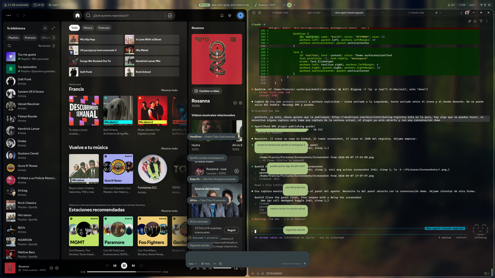
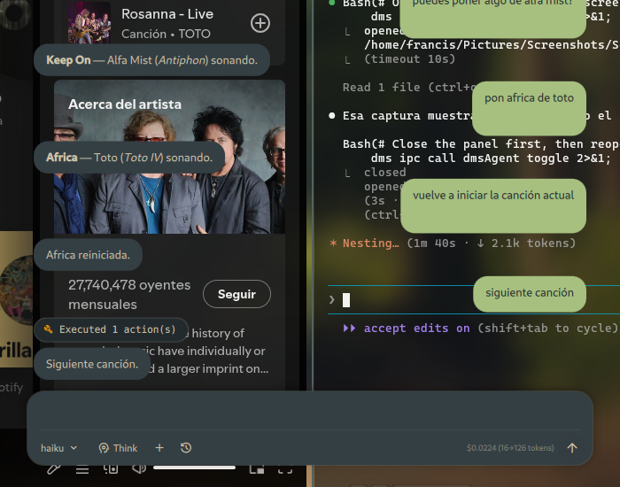

# DMS Agent

AI desktop assistant plugin for [DankMaterialShell](https://danklinux.com) powered by [Claude Code](https://claude.ai/claude-code).



A floating, transparent chat panel that lets you control your desktop with natural language. Ask it to open apps, switch windows, play music, search the web, manage files, and more — all without leaving your current context.



## Features

- **Claude Code integration** — Full access to Bash, Read, Write, Edit and all Claude Code tools
- **Session persistence** — Conversations persist across panel open/close via Claude CLI sessions
- **History** — Browse and resume previous conversations from Claude Code session history
- **Intent detection** — Common actions (go-to, open, close) pre-fetch context for faster responses
- **Model selector** — Switch between Haiku (fast), Sonnet (balanced), and Opus (best)
- **Extended thinking** — Toggle deep reasoning mode for complex tasks
- **Cost tracking** — See API costs and token usage per response
- **Cancel** — Stop any in-progress request
- **Floating panel** — Transparent overlay at bottom-center, keyboard-togglable
- **Theme-aware** — Adapts to your DMS theme colors automatically
- **Markdown rendering** — Responses render bold, italic, code, links, and lists
- **Desktop actions** — Niri window management, Spotify control via spogo, app launching with process detachment

## Requirements

- [DankMaterialShell](https://danklinux.com) >= 1.4.0
- [Claude Code CLI](https://claude.ai/claude-code) (`claude` command in PATH)
- `bash`, `curl`, `xdg-open`, `notify-send`
- niri compositor (for window management commands)

## Installation

Install from the DMS Plugin Browser, or manually:

```bash
cd ~/.config/DankMaterialShell/plugins/
git clone https://github.com/Francisdelca/dms-agent.git
```

Reload DMS to activate.

## Usage

- **Super+A** — Toggle the agent panel (requires keybinding setup)
- **Click the pill** in the bar to open/close
- **Escape** — Close the panel
- Type a message and press **Enter** to send

### Keybinding Setup

Add to your niri binds config (`~/.config/niri/dms/binds.kdl`):

```kdl
Mod+A hotkey-overlay-title="DMS Agent" { spawn "dms" "ipc" "call" "dmsAgent" "toggle"; }
```

### Examples

- `abre spotify` — Launches Spotify
- `llévame a whatsapp` — Focuses the WhatsApp window
- `cierra brave` — Closes the Brave browser
- `pon jazz en spotify` — Plays jazz via spogo
- `busca archivos pdf en descargas` — Searches files
- `cuánto espacio tengo en disco?` — System info

## Configuration

Access settings through the DMS plugin settings panel:

- **Model** — Claude model (haiku/sonnet/opus)
- **Extended Thinking** — Toggle deep reasoning
- **Max Tokens** — Response length limit
- **System Prompt** — Custom instructions

## License

MIT
